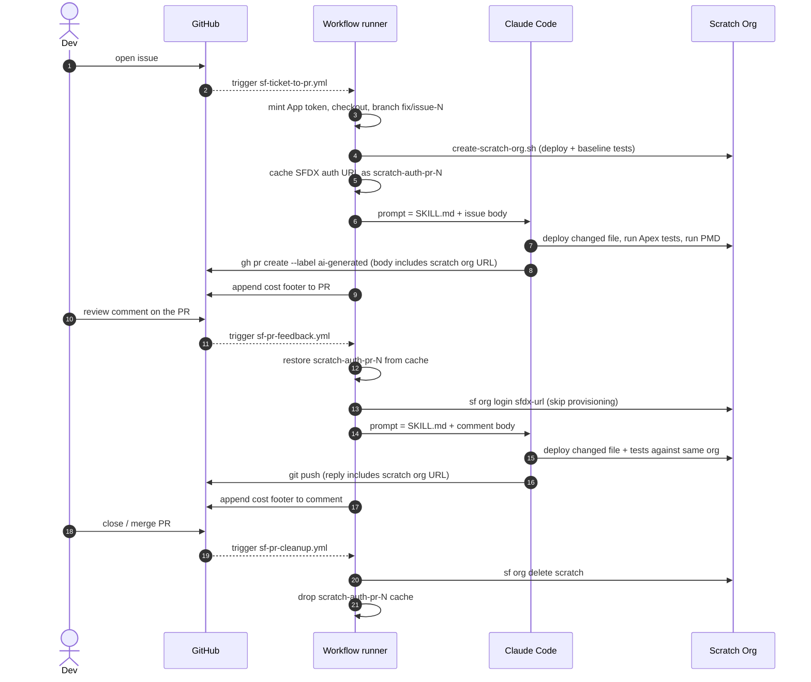

# SF Ticket → PR

A GitHub Actions pipeline that turns issues into tested pull requests, and turns reviewer comments on those PRs into follow-up commits. No human edits the code.

## TL;DR

1. Open an issue.
2. A PR appears in a few minutes — branch made, code deployed to a fresh scratch org, Apex tests green, PMD clean on touched lines. The PR description includes a clickable login URL to that scratch org so you can manually click around the change.
3. Comment on the PR in plain English.
4. A new commit lands — re-using the same scratch org from step 2 (no re-provisioning), so feedback iterations are fast.
5. Approve and merge — closing the PR deletes the scratch org automatically.

## Highlights

| | |
| --- | --- |
| 🛑 **Knows when to stop** | Schema changes, Flows, Permission Sets, vague repros → Claude posts a comment instead of forcing a bad fix. Stop conditions live in [SKILL.md](SKILL.md). |
| 🤖 **Bot identity** | Commits and PRs are attributed to `claude-bot[bot]` via a GitHub App, not a personal token. The human reviewer stays eligible to approve, and AI vs. human authorship is visible at a glance. |
| 🏗️ **Setup outside the loop** | Branching, scratch-org provisioning, deploy and baseline tests run as plain shell steps before Claude is invoked. The expensive turn-taking loop only sees a ready environment. |
| ♻️ **One script, dev + CI** | The runner runs the same [create-scratch-org.sh](../../../scripts/create-scratch-org.sh) a developer runs on their laptop — it just toggles `HEADLESS=true` to skip the steps that need a human (Data Library upload, manual permset assignments). One source of truth for "what is a working org". |
| 🏷️ **Persistent scratch org per PR** | The first run for an issue provisions a scratch org aliased `pr-<N>` and caches its SFDX auth URL via GitHub Actions cache. Every subsequent run on the same PR (more reviewer comments, workflow re-runs) restores the same org and skips the multi-minute provisioning path. When the PR closes, [sf-pr-cleanup.yml](../../../.github/workflows/sf-pr-cleanup.yml) deletes the org from the DevHub and drops the cache. |
| 🔗 **Click-through test URL** | Every PR description and every reply to a reviewer must contain a clickable auto-login URL to the persistent scratch org (see Step 4 in [SKILL.md](SKILL.md)). Reviewers click and exercise the change in the actual org without setting anything up locally. |
| 💰 **Cost per run** | Each run appends a `🤖 sonnet-4-6 · $0.12 · 18k tokens` footer to the PR or comment. The originating issue carries a sticky rollup across all iterations. |
| 🔀 **Two flows, one prompt** | Issue→PR and PR-comment→commit both invoke [SKILL.md](SKILL.md). |

## How it works



The runner does the deterministic work (CLI install, auth, branching, scratch-org provisioning). Claude is only asked to write code.

## File map

| File | Role |
| --- | --- |
| [.github/workflows/sf-ticket-to-pr.yml](../../../.github/workflows/sf-ticket-to-pr.yml) | Issue → PR. Fires on `issues: opened`. Provisions the per-PR scratch org and caches its auth URL. |
| [.github/workflows/sf-pr-feedback.yml](../../../.github/workflows/sf-pr-feedback.yml) | PR comment → commit. Fires on `issue_comment` / `pull_request_review_comment` if the PR has the `ai-generated` label. Restores the cached scratch org instead of re-provisioning. |
| [.github/workflows/sf-pr-cleanup.yml](../../../.github/workflows/sf-pr-cleanup.yml) | PR close → tear-down. Fires on `pull_request: closed`. Deletes the scratch org from the DevHub and removes the cached auth URL. |
| [SKILL.md](SKILL.md) | The prompt. Decide → Code → Verify → Ship. Stop conditions and anti-patterns at the bottom. |
| [.claude/settings.json](../../settings.json) | Tool allow-list for Claude (bash commands, `Read`/`Edit`/`Write`). |
| [scripts/create-scratch-org.sh](../../../scripts/create-scratch-org.sh) | The same script developers run locally; `HEADLESS=true` skips the human-only steps. |
| [scripts/report-ai-cost.sh](../../../scripts/report-ai-cost.sh) | Reads cost + tokens from the action's `execution_file` output, appends a footer to the PR/comment, updates the sticky rollup on the issue. |

## Adopt this in your repo

Prereqs: GitHub org admin, Salesforce DevHub, Anthropic API key.

### 1. Copy the files

```text
.github/workflows/sf-ticket-to-pr.yml
.github/workflows/sf-pr-feedback.yml
.github/workflows/sf-pr-cleanup.yml
.claude/skills/sf-ticket-to-pr/      (whole folder)
.claude/settings.json
scripts/create-scratch-org.sh
scripts/report-ai-cost.sh
```

Non-Salesforce repo? Keep everything except [scripts/create-scratch-org.sh](../../../scripts/create-scratch-org.sh) and the SF CLI steps in the workflows. Replace the deploy/test commands in [SKILL.md](SKILL.md) with your toolchain's equivalents.

Provisioning contract: `HEADLESS=true ./scripts/create-scratch-org.sh` must exit 0 when the environment is ready. No prompts, no `sf org open`, no human-gated waits.

### 2. Create the Claude Bot GitHub App (org-wide, once)

The default `GITHUB_TOKEN` cannot push branches that contain workflow files — GitHub blocks it regardless of the `permissions:` block. A GitHub App with the `workflows` permission is the canonical fix and also keeps authorship attributed to a bot user.

In **Settings → Developer settings → GitHub Apps → New GitHub App**:

- Disable webhooks.
- Repository permissions — **Contents**, **Issues**, **Pull requests**, **Workflows**: read & write. **Metadata**: read.
- Restrict installation to your own account.
- Generate a private key (PEM); note the numeric App ID.
- **Install** the App on the target repo.

### 3. Set repo secrets

In **Settings → Secrets and variables → Actions**:

| Secret | Value |
| --- | --- |
| `CLAUDE_BOT_APP_ID` | Numeric App ID from step 2. |
| `CLAUDE_BOT_PRIVATE_KEY` | Full PEM, including `BEGIN`/`END` lines. |
| `SFDX_AUTH_URL` | `sf org display --verbose --target-org <devhub> --json \| jq -r '.result.sfdxAuthUrl'` |
| `ANTHROPIC_API_KEY` | Anthropic API key. Or set `CLAUDE_CODE_OAUTH_TOKEN` instead to bill an Anthropic Max subscription. |

### 4. Create the label

```bash
gh label create ai-generated \
  --description "PR opened by the SF ticket-to-PR pipeline" \
  --color FBCA04
```

The PR-feedback workflow filters on this label; the issue workflow applies it via [SKILL.md](SKILL.md).

### 5. Smoke test

Open a small, well-scoped issue. The workflow fires, a PR appears, the cost footer shows up on the PR body. Comment on the PR asking for a tweak — a new commit lands on the same branch.

## Under the hood

### Cost reporting

[anthropics/claude-code-action](https://github.com/anthropics/claude-code-action) emits an `execution_file` output — a JSON array of the SDK messages from the run. [scripts/report-ai-cost.sh](../../../scripts/report-ai-cost.sh) reads the final `result` message with `jq`, pulls `total_cost_usd` and the per-token-type usage, and:

- Appends a one-line footer to the PR body (issue flow) or to the triggering comment (feedback flow).
- Maintains a sticky comment on the originating issue (resolved from `Closes #N` in the PR body). Each run is stored as an HTML marker like `<!-- run wf=… cost=… tokens=… -->`, so totals can be re-derived from the comment without parsing prose.

No `ccusage`, no `npm`, no JSONL diffing — the action already has the numbers.

### Bot authorship

The git author email is derived at runtime from the App's installation slug as `${USER_ID}+${APP_SLUG}[bot]@users.noreply.github.com` — the only form GitHub accepts on the `noreply` domain for `[bot]` users. See the **Create branch for the fix** step in [.github/workflows/sf-ticket-to-pr.yml](../../../.github/workflows/sf-ticket-to-pr.yml).

### Persistent scratch org per PR

Each PR gets its own scratch org aliased `pr-<issue-number>`, alive for the whole life of the PR. Re-provisioning costs minutes (package installs, deploys, sample data, agent activation), so doing it on every reviewer comment was the main source of latency in the feedback loop.

How the persistence works:

1. **First run** ([sf-ticket-to-pr.yml](../../../.github/workflows/sf-ticket-to-pr.yml)) provisions the org normally via [create-scratch-org.sh](../../../scripts/create-scratch-org.sh), then writes the org's SFDX auth URL to `/tmp/sfdx-auth-pr-<N>.url`. GitHub Actions cache saves that path under key `scratch-auth-pr-<N>` at job end.
2. **Every subsequent run** ([sf-ticket-to-pr.yml](../../../.github/workflows/sf-ticket-to-pr.yml) re-runs and every [sf-pr-feedback.yml](../../../.github/workflows/sf-pr-feedback.yml) fire) restores the cache before invoking `create-scratch-org.sh`. The script sees the cached file, runs `sf org login sfdx-url`, validates the org with `sf org display`, and exits early — no deploys, no permsets, no agent activation.
3. **Cache miss / org expired** (e.g. PR open longer than the 30-day scratch-org lifetime, or cache evicted): the early-return validation fails, the script falls through to the full provisioning path and writes a fresh auth URL to the cache. Self-healing.
4. **Concurrency**: both workflows declare a `concurrency:` group keyed on the PR/issue number so two reviewer comments arriving in parallel don't race a deploy against the same org.
5. **Cleanup**: [sf-pr-cleanup.yml](../../../.github/workflows/sf-pr-cleanup.yml) fires on `pull_request: closed` (merged or not), runs `sf org delete scratch --target-org pr-<N>` and `gh cache delete scratch-auth-pr-<N>`. Best-effort — if either is already gone it logs a notice and continues.

Why cache the auth URL instead of, say, a per-PR repo secret: the cache is repo-scoped, branch-namespaced (so fork PRs can't read it), and managed by a single off-the-shelf action. No `gh secret set/delete` dance, no plaintext leakage in workflow logs.

### Stop conditions

Defined in [SKILL.md](SKILL.md). Claude posts a comment and exits when the issue or feedback requires:

- Schema changes (objects, fields, relationships)
- Flows, Permission Sets, Custom Metadata, or anything under `unpackaged/`
- Data Cloud, External Services, Named Credentials, `config/`, or `sfdx-project.json`
- A vague repro or feedback that contradicts the original issue
- A cross-component architectural decision

## Open follow-ups

- Verify-step parity in the PR-feedback workflow.
- Broader ticket shapes end-to-end (small features, not only bug fixes).
