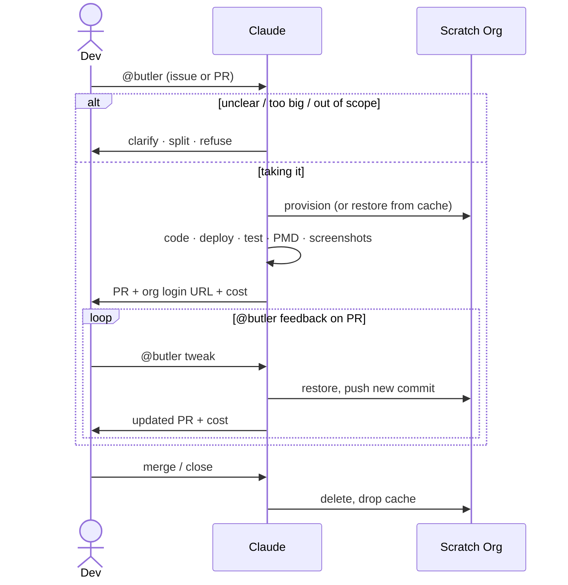

# SF Ticket to PR

A GitHub Actions pipeline that turns `@butler` mentions into pull requests. Claude reads the thread, writes the code, deploys it to a live scratch org, and posts evidence back. Every follow-up `@butler` on the PR lands a new commit on the same branch in the same org — no re-provisioning.



`@butler` works in issue bodies, issue comments, PR reviews, and PR review replies.

## Features

| | |
| --- | --- |
| 💬 **No state machine** | Every fire reads the full thread fresh. No labels carry state between runs. If butler refused last time, mention it again with more context. |
| 🛑 **Triage before infra** | The triage job runs only Claude — no scratch org, no SF CLI. Clarification, split, and refusal outcomes cost cents each, not a provisioning cycle. |
| 🏷️ **Persistent scratch org** | The org is provisioned once and cached for the entire PR lifetime. Follow-up runs restore it in seconds. |
| 🔗 **Self-evidencing PRs** | Every PR body and reviewer reply includes a clickable auto-login URL to the scratch org plus inline Playwright screenshots for UI changes. |
| 💰 **Cost transparency** | Both triage and execute report cost. The originating issue carries a sticky rollup, one row per `@butler` cycle. |
| 🤖 **No GitHub App needed** | Commits and PRs go out as `github-actions[bot]` via the built-in `GITHUB_TOKEN`. Bot-authored events don't retrigger the workflow, so the agent can't summon itself. |
| ♻️ **One script for dev and CI** | [create-scratch-org.sh](../../../scripts/create-scratch-org.sh) is what developers run locally too — CI just sets `HEADLESS=true`. |

## How it works

### Triage

The first job in [sf-ticket-to-pr.yml](../../../.github/workflows/sf-ticket-to-pr.yml) runs only Claude — no Salesforce CLI, no scratch org. This is deliberate: a clarification or refusal costs cents, not a provisioning cycle. The agent reads the full thread against [SKILL.md](SKILL.md) and picks one outcome:

- **Take it** — posts a plan, ends the comment with a hidden `<!-- butler:proceed -->` marker. The execute job greps for it.
- **Clarify** — asks one or two specific questions. Stops.
- **Split** — proposes sub-stories. Stops. A human opens them and mentions butler on each.
- **Refuse** — one sentence, no marker. Stops. For out-of-scope changes or a repo-specific refuse-list in `CLAUDE.md`.

### Execute

The scratch org is provisioned once on the first run for an issue. Its SFDX auth URL is cached under key `scratch-auth-pr-<issue-number>` — keyed on the issue, not the PR, so the same org is reused across the issue run and every PR follow-up. [create-scratch-org.sh](../../../scripts/create-scratch-org.sh) detects the cached file on subsequent runs, re-logs in, validates the org, and exits without reprovisioning. If the org has expired (30-day limit) or the cache was evicted, the script falls through to a full provision. A `concurrency:` group keyed on the issue number serializes concurrent runs against the same org.

Claude runs in `bypassPermissions` mode — the `author_association` gate on the workflow already handles access control. It has access to the Playwright MCP server via [.mcp.json](../../../.mcp.json) for UI verification of user-visible changes.

### Cost reporting

[anthropics/claude-code-action](https://github.com/anthropics/claude-code-action) emits an `execution_file` with the SDK messages. [report-ai-cost.sh](../../../scripts/report-ai-cost.sh) extracts cost and tokens, appends a footer to the PR or comment, and updates a sticky rollup on the originating issue. Each run is stored as a hidden HTML marker so totals survive comment edits. Both triage and execute call this script.

### Cleanup

[sf-pr-cleanup.yml](../../../.github/workflows/sf-pr-cleanup.yml) fires on PR close and deletes the scratch org and cache entry. Best-effort — if either is already gone it logs a notice and continues.

## Adopting this

Prereqs: GitHub org admin, Salesforce DevHub, Anthropic API key.

**Copy the files:**

```text
.github/workflows/sf-ticket-to-pr.yml
.github/workflows/sf-pr-cleanup.yml
.claude/skills/sf-ticket-to-pr/
.claude/settings.json
.mcp.json
scripts/create-scratch-org.sh
scripts/report-ai-cost.sh
```

**Set repo secrets** in Settings → Secrets and variables → Actions:

| Secret | Value |
| --- | --- |
| `SFDX_AUTH_URL` | `sf org display --verbose --target-org <devhub> --json \| jq -r '.result.sfdxAuthUrl'` |
| `ANTHROPIC_API_KEY` | Your Anthropic API key. Or use `CLAUDE_CODE_OAUTH_TOKEN` to bill a Max subscription instead. |

The built-in `GITHUB_TOKEN` covers everything else — no PAT or GitHub App. Trade-off: the agent can't push branches that touch `.github/workflows/`, which is intentional.

**Create the label:**

```bash
gh label create ai-involved --description "Butler (AI) was involved in this issue or PR" --color FBCA04
```

**Adapt the provisioning contract:** `HEADLESS=true ./scripts/create-scratch-org.sh` must exit 0 when the environment is ready. No prompts, no `sf org open`.

Non-Salesforce repo? Drop [create-scratch-org.sh](../../../scripts/create-scratch-org.sh) and replace the deploy/test commands in [SKILL.md](SKILL.md) with your toolchain's equivalents. Want a different trigger word? Search-and-replace `@butler` in [sf-ticket-to-pr.yml](../../../.github/workflows/sf-ticket-to-pr.yml) and [SKILL.md](SKILL.md).
