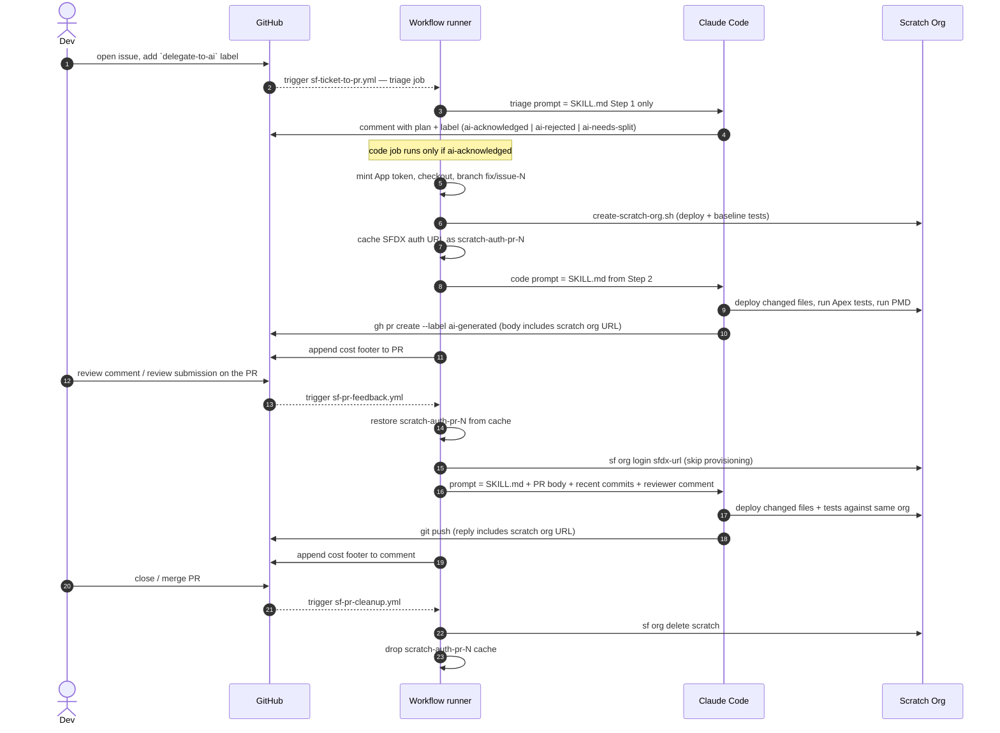

# SF Ticket → PR

A GitHub Actions pipeline that turns issues into tested pull requests, and turns reviewer comments on those PRs into follow-up commits. No human edits the code.

## TL;DR

1. Open an issue, then add the `delegate-to-ai` label.
2. A cheap **triage** job runs first — Claude reads the ticket and posts one of three replies: *acknowledge with plan*, *reject with reason*, *split into smaller stories*. No scratch org spun up at this point.
3. On acknowledge only, a second job runs: branch, scratch org, code, Apex tests, PMD on touched lines, PR opened. The PR description includes a clickable login URL to the org so you can click around the change.
4. Comment or review on the PR in plain English. A new commit lands on the same branch, reusing the same scratch org from step 3.
5. Approve and merge — closing the PR deletes the scratch org automatically.

## Highlights

| | |
| --- | --- |
| 🛑 **Triage before infra** | The first job runs only Claude — no scratch org, no SF CLI. Reject and Split outcomes cost a couple of cents each, not a multi-minute provisioning. The expensive code job is gated on the `ai-acknowledged` label the triage produced. |
| 🤖 **Bot identity, no setup** | Commits and PRs are attributed to the built-in `github-actions[bot]` via the default `GITHUB_TOKEN`. No GitHub App, no secrets to rotate. The human reviewer stays eligible to approve, AI authorship is visible at a glance, and bot-authored events do not retrigger our workflows (no skipped-run noise). |
| ♻️ **One script, dev + CI** | The runner runs the same [create-scratch-org.sh](../../../scripts/create-scratch-org.sh) a developer runs on their laptop — it just toggles `HEADLESS=true` to skip the steps that need a human (Data Library upload, manual permset assignments). One source of truth for "what is a working org". |
| 🏷️ **Persistent scratch org per PR** | The first acknowledge-run for an issue provisions a scratch org aliased `pr-<N>` and caches its SFDX auth URL via GitHub Actions cache. Every subsequent run (re-runs, reviewer feedback) restores the same org and skips the multi-minute provisioning path. When the PR closes, [sf-pr-cleanup.yml](../../../.github/workflows/sf-pr-cleanup.yml) deletes the org from the DevHub and drops the cache. |
| 🔗 **Click-through test URL** | Every PR description and every reply to a reviewer contains a clickable auto-login URL to the persistent scratch org. Reviewers click and exercise the change in the actual org without setting anything up locally. |
| 💰 **Cost per run** | Each run appends a `🤖 sonnet-4-6 · $0.12 · 18k tokens` footer to the PR or comment. The originating issue carries a sticky rollup across all iterations. Triage runs add a line; rejected stories never reach the costly code path. |
| 🔀 **Two flows, one prompt** | Issue→PR and PR-feedback→commit both invoke [SKILL.md](SKILL.md). |

## How it works



The runner does the deterministic work (CLI install, auth, branching, scratch-org provisioning). Claude is only asked to triage and to write code.

## File map

| File | Role |
| --- | --- |
| [.github/workflows/sf-ticket-to-pr.yml](../../../.github/workflows/sf-ticket-to-pr.yml) | Issue → PR. Fires when the `delegate-to-ai` label is added to an issue. Two jobs: a cheap **triage** that runs Claude with no infra, and a **code** job (gated on `ai-acknowledged`) that provisions the per-PR scratch org and caches its auth URL. |
| [.github/workflows/sf-pr-feedback.yml](../../../.github/workflows/sf-pr-feedback.yml) | PR comment / review → commit. Fires on `issue_comment`, `pull_request_review`, or `pull_request_review_comment` if the PR has the `ai-generated` label. Restores the cached scratch org instead of re-provisioning. |
| [.github/workflows/sf-pr-cleanup.yml](../../../.github/workflows/sf-pr-cleanup.yml) | PR close → tear-down. Fires on `pull_request: closed`. Deletes the scratch org from the DevHub and removes the cached auth URL. |
| [SKILL.md](SKILL.md) | The prompt. Triage → Code → Verify → Ship. Anti-patterns at the bottom. |
| [.claude/settings.json](../../settings.json) | Tool allow-list for Claude (bash commands, `Read`/`Edit`/`Write`). |
| [scripts/create-scratch-org.sh](../../../scripts/create-scratch-org.sh) | The same script developers run locally; `HEADLESS=true` skips the human-only steps. |
| [scripts/report-ai-cost.sh](../../../scripts/report-ai-cost.sh) | Reads cost + tokens from the action's `execution_file` output, appends a footer to the PR/comment, updates the sticky rollup on the issue. |

## Adopt this in your repo

Prereqs: GitHub org admin, Salesforce DevHub, Anthropic API key.

### 1. Copy the files

```text
.github/workflows/sf-ticket-to-pr.yml
.github/workflows/sf-pr-feedback.yml
.github/workflows/sf-pr-cleanup.yml
.claude/skills/sf-ticket-to-pr/      (whole folder)
.claude/settings.json
scripts/create-scratch-org.sh
scripts/report-ai-cost.sh
```

Non-Salesforce repo? Keep everything except [scripts/create-scratch-org.sh](../../../scripts/create-scratch-org.sh) and the SF CLI steps in the workflows. Replace the deploy/test commands in [SKILL.md](SKILL.md) with your toolchain's equivalents.

Provisioning contract: `HEADLESS=true ./scripts/create-scratch-org.sh` must exit 0 when the environment is ready. No prompts, no `sf org open`, no human-gated waits.

### 2. Set repo secrets

In **Settings → Secrets and variables → Actions**:

| Secret | Value |
| --- | --- |
| `SFDX_AUTH_URL` | `sf org display --verbose --target-org <devhub> --json \| jq -r '.result.sfdxAuthUrl'` |
| `ANTHROPIC_API_KEY` | Anthropic API key. Or set `CLAUDE_CODE_OAUTH_TOKEN` instead to bill an Anthropic Max subscription. |

The workflows authenticate with the built-in `GITHUB_TOKEN` for everything else — no GitHub App or PAT to set up. Trade-off: the agent cannot push branches that touch `.github/workflows/` files. That's intentional — CI changes belong in a separate human PR.

### 3. Create the labels

```bash
gh label create delegate-to-ai      --description "Hand this issue to the AI pipeline"            --color 0E8A16
gh label create ai-generated        --description "PR opened by the SF ticket-to-PR pipeline"     --color FBCA04
gh label create ai-acknowledged     --description "AI accepted the ticket and is implementing it" --color BFD4F2
gh label create ai-rejected         --description "AI declined — see triage comment for reason"   --color D93F0B
gh label create ai-needs-split      --description "AI thinks this should be split into smaller stories" --color FBCA04
```

`delegate-to-ai` triggers the pipeline. The other four are applied by the agent itself: triage outcomes (`ai-acknowledged` / `ai-rejected` / `ai-needs-split`) and the PR marker (`ai-generated`, used by the feedback workflow's filter).

### 4. Smoke test

Open a small, well-scoped issue and add the `delegate-to-ai` label. The triage job fires, the agent comments with a plan and adds `ai-acknowledged`, the code job spins up the scratch org and opens a PR with a cost footer. Submit a review on the PR asking for a tweak — a new commit lands on the same branch.

## Under the hood

### Cost reporting

[anthropics/claude-code-action](https://github.com/anthropics/claude-code-action) emits an `execution_file` output — a JSON array of the SDK messages from the run. [scripts/report-ai-cost.sh](../../../scripts/report-ai-cost.sh) reads the final `result` message with `jq`, pulls `total_cost_usd` and the per-token-type usage, and:

- Appends a one-line footer to the PR body (issue flow) or to the triggering comment (feedback flow).
- Maintains a sticky comment on the originating issue (resolved from `Closes #N` in the PR body). Each run is stored as an HTML marker like `<!-- run wf=… cost=… tokens=… -->`, so totals can be re-derived from the comment without parsing prose.

No `ccusage`, no `npm`, no JSONL diffing — the action already has the numbers.

### Bot authorship

Commits and PRs are authored by `github-actions[bot]` using its `noreply` email `41898282+github-actions[bot]@users.noreply.github.com` — the form GitHub accepts on the `noreply` domain for built-in `[bot]` users. The git config is set in the **Create branch for the fix** step in [.github/workflows/sf-ticket-to-pr.yml](../../../.github/workflows/sf-ticket-to-pr.yml). Because events fired by the default `GITHUB_TOKEN` do not retrigger workflows, no skipped-run noise accumulates from the bot's own labels and comments.

### Persistent scratch org per PR

Each PR gets its own scratch org aliased `pr-<issue-number>`, alive for the whole life of the PR. Re-provisioning costs minutes (package installs, deploys, sample data, agent activation), so doing it on every reviewer comment was the main source of latency in the feedback loop.

How the persistence works:

1. **First run** ([sf-ticket-to-pr.yml](../../../.github/workflows/sf-ticket-to-pr.yml)) provisions the org normally via [create-scratch-org.sh](../../../scripts/create-scratch-org.sh), then writes the org's SFDX auth URL to `/tmp/sfdx-auth-pr-<N>.url`. GitHub Actions cache saves that path under key `scratch-auth-pr-<N>` at job end.
2. **Every subsequent run** ([sf-ticket-to-pr.yml](../../../.github/workflows/sf-ticket-to-pr.yml) re-runs and every [sf-pr-feedback.yml](../../../.github/workflows/sf-pr-feedback.yml) fire) restores the cache before invoking `create-scratch-org.sh`. The script sees the cached file, runs `sf org login sfdx-url`, validates the org with `sf org display`, and exits early — no deploys, no permsets, no agent activation.
3. **Cache miss / org expired** (e.g. PR open longer than the 30-day scratch-org lifetime, or cache evicted): the early-return validation fails, the script falls through to the full provisioning path and writes a fresh auth URL to the cache. Self-healing.
4. **Concurrency**: both workflows declare a `concurrency:` group keyed on the PR/issue number so two reviewer comments arriving in parallel don't race a deploy against the same org.
5. **Cleanup**: [sf-pr-cleanup.yml](../../../.github/workflows/sf-pr-cleanup.yml) fires on `pull_request: closed` (merged or not), runs `sf org delete scratch --target-org pr-<N>` and `gh cache delete scratch-auth-pr-<N>`. Best-effort — if either is already gone it logs a notice and continues.

Why cache the auth URL instead of, say, a per-PR repo secret: the cache is repo-scoped, branch-namespaced (so fork PRs can't read it), and managed by a single off-the-shelf action. No `gh secret set/delete` dance, no plaintext leakage in workflow logs.

### Triage outcomes

Step 1 of [SKILL.md](SKILL.md) is a three-way exit. The agent picks exactly one and applies the matching label:

- **`ai-acknowledged`** — issue is clear, in-scope, finishable in one run. The plan goes in the comment, the code job picks it up.
- **`ai-rejected`** — vague repro, schema change, Flow / Permission Set work, or any other class of change the agent shouldn't take on its own. The comment names the missing piece a human needs to provide.
- **`ai-needs-split`** — implementable but too big for one run (multiple Apex classes, cross-subsystem). The comment proposes sub-issues; humans open them and re-delegate.

The full self-check (how many classes touched? how many tests? cross-subsystem?) lives in [SKILL.md](SKILL.md).

## Open follow-ups

- Verify-step parity in the PR-feedback workflow (notify-on-failure step is still ticket-only).
- Triage-job cost rollup — currently only the code-phase cost is reported.
