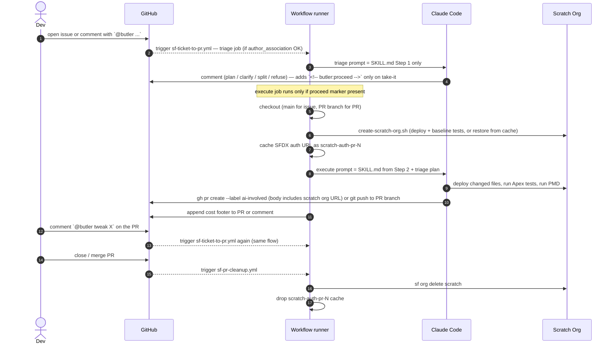

# SF Ticket to PR

A GitHub Actions pipeline that turns `@butler` mentions on issues and PRs into tested pull requests. A maintainer writes `@butler` in a comment; Claude reads the thread, decides what to do, and either ships a PR or posts back with a question, a split proposal, or a refusal.

## TL;DR

1. Open an issue and write `@butler` in the body (or comment `@butler <instruction>` later).
2. A cheap **triage** job runs first — Claude reads the full thread and posts a reply. Either it commits to the work (with a plan + a hidden `<!-- butler:proceed -->` marker) or it asks for clarification, proposes a split, or refuses. No scratch org spun up yet.
3. On proceed only, an **execute** job runs: branch, scratch org, code, Apex tests, PMD on touched lines, PR opened. The PR description includes a clickable login URL to the org so you can click around the change.
4. Comment `@butler <feedback>` on the PR in plain English. A new commit lands on the same branch, reusing the same scratch org from step 3.
5. Approve and merge — closing the PR deletes the scratch org automatically.

## Highlights

| | |
| --- | --- |
| 💬 **Mention-driven, no state machine** | Every fire reads the full thread fresh. There are no acknowledge/reject/needs-split labels carrying state across runs. If butler refused last time, mention it again with an override and it picks the new signal up. |
| 🚪 **Author-association gate** | Only events from `OWNER`, `MEMBER`, or `COLLABORATOR` fire the workflow. A random visitor typing `@butler` in their own issue gets silently ignored — no Anthropic credits burn. |
| 🛑 **Triage before infra** | The triage job runs only Claude — no scratch org, no SF CLI. Clarification / split / refusal outcomes cost a couple of cents each, not a multi-minute provisioning. The expensive execute job is gated on the agent leaving a `<!-- butler:proceed -->` marker in its triage comment. |
| 🤖 **Bot identity, no setup** | Commits and PRs are attributed to the built-in `github-actions[bot]` via the default `GITHUB_TOKEN`. No GitHub App, no secrets to rotate. The human reviewer stays eligible to approve, AI authorship is visible at a glance, and bot-authored events do not retrigger workflows (no recursion). |
| ♻️ **One script, dev + CI** | The runner runs the same [create-scratch-org.sh](../../../scripts/create-scratch-org.sh) a developer runs on their laptop — it just toggles `HEADLESS=true` to skip the steps that need a human. One source of truth for "what is a working org". |
| 🏷️ **Persistent scratch org per PR** | The first execute run for an issue provisions a scratch org aliased `pr-<N>` and caches its SFDX auth URL via GitHub Actions cache. Every subsequent run restores the same org and skips the multi-minute provisioning path. When the PR closes, [sf-pr-cleanup.yml](../../../.github/workflows/sf-pr-cleanup.yml) deletes the org from the DevHub and drops the cache. |
| 🔗 **Click-through test URL** | Every PR description and every reply to a reviewer contains a clickable auto-login URL to the persistent scratch org. Reviewers click and exercise the change in the actual org without setting anything up locally. |
| 💰 **Cost per run** | Each run appends a `🤖 sonnet-4-6 · $0.12 · 18k tokens` footer to the PR or comment. The originating issue carries a sticky rollup across all iterations. |

## How it works

The pipeline is one workflow with two jobs that span two `gh` event types — issue events and PR-comment events. The entry point is identical: an `@butler` mention from a maintainer-class user. There is no label gate; cost protection comes from checking `author_association` on every event.

**Triage.** [sf-ticket-to-pr.yml](../../../.github/workflows/sf-ticket-to-pr.yml) starts with a triage job that runs only Claude — no Salesforce CLI is even installed. The agent reads the full thread against [SKILL.md](SKILL.md) Step 1, decides between take-it / clarify / split / refuse, and posts a comment. If it's taking the work, it ends the comment with an invisible `<!-- butler:proceed -->` HTML comment; the next step in the workflow greps for that marker to decide whether to proceed.

**Execute.** Only when the proceed marker is present does the second job run. For an issue, it checks out main, creates `fix/issue-<N>`, restores the cached scratch-org auth URL if one exists, runs `create-scratch-org.sh`, and hands Claude the triage plan. For a PR, it checks out the existing branch instead and restores the same scratch org. Claude continues from Step 2 of the skill — implement, deploy only the changed files, run Apex tests, run PMD on touched lines, commit, open or update the PR with the scratch-org login URL in the body, and stop. A verify step then reports the run's cost on both the PR footer and the issue rollup; if the run errored, a comment with the run-log link is posted.

**Cleanup.** When the PR closes (merged or not), [sf-pr-cleanup.yml](../../../.github/workflows/sf-pr-cleanup.yml) deletes the scratch org from the DevHub and drops the cached auth URL. Best-effort — if either is already gone, the job logs a notice and exits cleanly.



The runner does the deterministic work (CLI install, auth, branching, scratch-org provisioning). Claude is only asked to triage and to write code.

## File map

| File | Role |
| --- | --- |
| [.github/workflows/sf-ticket-to-pr.yml](../../../.github/workflows/sf-ticket-to-pr.yml) | The entire interactive pipeline. Triggers on issue events and PR-comment events. Triage job runs Claude with no infra; execute job (gated on the `butler:proceed` marker) provisions the per-PR scratch org and caches its auth URL. |
| [.github/workflows/sf-pr-cleanup.yml](../../../.github/workflows/sf-pr-cleanup.yml) | PR close → tear-down. Fires on `pull_request: closed`. Deletes the scratch org from the DevHub and removes the cached auth URL. |
| [SKILL.md](SKILL.md) | The prompt. Read the thread → decide → Code → Verify → Ship. Anti-patterns at the bottom. |
| [.claude/settings.json](../../settings.json) | Tool allow-list for Claude. |
| [scripts/create-scratch-org.sh](../../../scripts/create-scratch-org.sh) | The same script developers run locally; `HEADLESS=true` skips the human-only steps. |
| [scripts/report-ai-cost.sh](../../../scripts/report-ai-cost.sh) | Reads cost + tokens from the action's `execution_file` output, appends a footer to the PR/comment, updates the sticky rollup on the issue. |

## Adopt this in your repo

Prereqs: GitHub org admin, Salesforce DevHub, Anthropic API key.

### 1. Copy the files

```text
.github/workflows/sf-ticket-to-pr.yml
.github/workflows/sf-pr-cleanup.yml
.claude/skills/sf-ticket-to-pr/      (whole folder)
.claude/settings.json
scripts/create-scratch-org.sh
scripts/report-ai-cost.sh
```

Non-Salesforce repo? Keep everything except [scripts/create-scratch-org.sh](../../../scripts/create-scratch-org.sh) and the SF CLI steps in the workflow. Replace the deploy/test commands in [SKILL.md](SKILL.md) with your toolchain's equivalents.

Want a different trigger word than `@butler`? Search-and-replace `@butler` in [sf-ticket-to-pr.yml](../../../.github/workflows/sf-ticket-to-pr.yml) and in [SKILL.md](SKILL.md). The string is plain text — no GitHub App or bot account needed.

Provisioning contract: `HEADLESS=true ./scripts/create-scratch-org.sh` must exit 0 when the environment is ready. No prompts, no `sf org open`, no human-gated waits.

### 2. Set repo secrets

In **Settings → Secrets and variables → Actions**:

| Secret | Value |
| --- | --- |
| `SFDX_AUTH_URL` | `sf org display --verbose --target-org <devhub> --json \| jq -r '.result.sfdxAuthUrl'` |
| `ANTHROPIC_API_KEY` | Anthropic API key. Or set `CLAUDE_CODE_OAUTH_TOKEN` instead to bill an Anthropic Max subscription. |

The workflow authenticates with the built-in `GITHUB_TOKEN` for everything else — no GitHub App or PAT to set up. Trade-off: the agent cannot push branches that touch `.github/workflows/` files. That's intentional — CI changes belong in a separate human PR.

### 3. Create the label

```bash
gh label create ai-involved --description "Butler (AI) was involved in this issue or PR" --color FBCA04
```

That's the only label the pipeline uses. The triage job stamps it on every issue or PR it touches, regardless of outcome (take / clarify / split / refuse), so humans can filter the list at a glance. No state labels — every triage fire reads the full thread fresh.

### 4. Smoke test

Open a small, well-scoped issue and write `@butler please do this` in the body. The triage job fires, the agent comments with a plan, the execute job spins up the scratch org and opens a PR with a cost footer. Comment `@butler rename the class to Foo` on the PR — a new commit lands on the same branch.

## Under the hood

### Cost reporting

[anthropics/claude-code-action](https://github.com/anthropics/claude-code-action) emits an `execution_file` output — a JSON array of the SDK messages from the run. [scripts/report-ai-cost.sh](../../../scripts/report-ai-cost.sh) reads the final `result` message with `jq`, pulls `total_cost_usd` and the per-token-type usage, and:

- Appends a one-line footer to the PR body (issue flow) or to the triggering comment (feedback flow).
- Maintains a sticky comment on the originating issue (resolved from `Closes #N` in the PR body). Each run is stored as an HTML marker like `<!-- run wf=… cost=… tokens=… -->`, so totals can be re-derived from the comment without parsing prose.

No `ccusage`, no `npm`, no JSONL diffing — the action already has the numbers.

### Bot authorship

Commits and PRs are authored by `github-actions[bot]` using its `noreply` email `41898282+github-actions[bot]@users.noreply.github.com` — the form GitHub accepts on the `noreply` domain for built-in `[bot]` users. The git config is set in the **Configure git** step in [sf-ticket-to-pr.yml](../../../.github/workflows/sf-ticket-to-pr.yml). Because events fired by the default `GITHUB_TOKEN` do not retrigger workflows, the bot cannot summon itself.

### Persistent scratch org per PR

Each PR gets its own scratch org aliased `pr-<issue-number>`, alive for the whole life of the PR. Re-provisioning costs minutes (package installs, deploys, sample data, agent activation), so doing it on every reviewer comment was the main source of latency in the feedback loop.

How the persistence works:

1. **First execute run** for an issue provisions the org normally via [create-scratch-org.sh](../../../scripts/create-scratch-org.sh), then writes the org's SFDX auth URL to `/tmp/sfdx-auth-pr-<N>.url`. GitHub Actions cache saves that path under key `scratch-auth-pr-<N>` at job end.
2. **Every subsequent run** restores the cache before invoking `create-scratch-org.sh`. The script sees the cached file, runs `sf org login sfdx-url`, validates the org with `sf org display`, and exits early — no deploys, no permsets, no agent activation.
3. **Cache miss / org expired** (e.g. PR open longer than the 30-day scratch-org lifetime, or cache evicted): the early-return validation fails, the script falls through to the full provisioning path and writes a fresh auth URL to the cache. Self-healing.
4. **Concurrency**: the workflow declares a `concurrency:` group keyed on the issue/PR number so two `@butler` mentions arriving in parallel don't race a deploy against the same org.
5. **Cleanup**: [sf-pr-cleanup.yml](../../../.github/workflows/sf-pr-cleanup.yml) fires on `pull_request: closed` (merged or not), runs `sf org delete scratch --target-org pr-<N>` and `gh cache delete scratch-auth-pr-<N>`. Best-effort — if either is already gone it logs a notice and continues.

Why cache the auth URL instead of, say, a per-PR repo secret: the cache is repo-scoped, branch-namespaced (so fork PRs can't read it), and managed by a single off-the-shelf action. No `gh secret set/delete` dance, no plaintext leakage in workflow logs.

### Triage outcomes

Step 1 of [SKILL.md](SKILL.md) is a four-way decision. The agent picks one and writes a comment that says which:

- **Take it.** Plan goes in the comment, with a trailing `<!-- butler:proceed -->` marker. The execute job picks it up.
- **Ask for clarification.** Question goes in the comment, no marker. Stops.
- **Propose a split.** Sub-stories listed in the comment, no marker. Stops. A human opens the sub-issues and mentions butler on them.
- **Refuse.** Reason in one sentence, no marker. Stops. Refusals are for changes that genuinely shouldn't go through the pipeline — Data Cloud / External Services / Named Credentials (known platform bugs), or changes to `config/` / `sfdx-project.json` / `.github/workflows/` (these need a human PR for safety).

The full sizing heuristic (when to take vs split) lives in [SKILL.md](SKILL.md).

## Open follow-ups

- Verify-step parity in the execute job (notify-on-failure step exists but doesn't double as a "did a PR materialise" check).
- Triage-job cost rollup — currently only the code-phase cost is reported.
