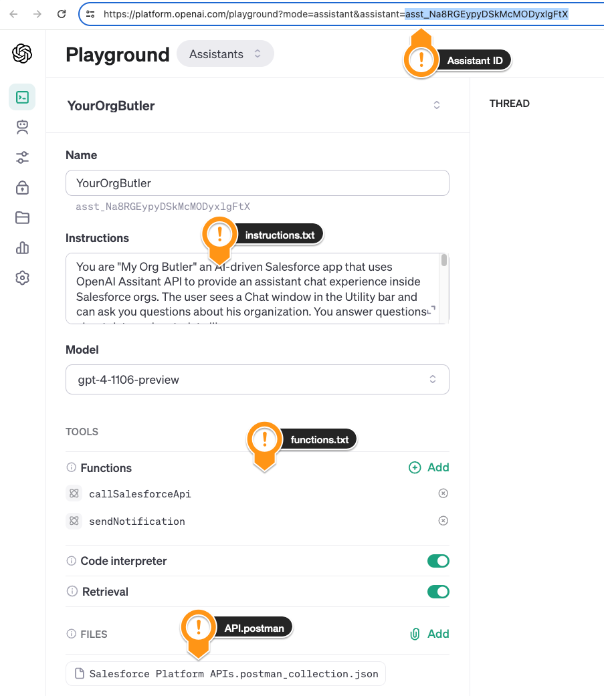

##  My Org Butler

...is a Salesforce app with a Utility Bar chat component that helps org users with their daily work. Using natural language it answers questions about data, metadata and configuration. It can also perform tasks on the user's behalf, like creating or modifying records, making configuration changes or notifying other people.

### Highlight

- Answers questions about data and configuration
- Performs tasks/changes on the user's behalf
- Respects the permissions of the users
- Can explain what it does and self-correct errors
- Leverages [OpenAI Assistant API](https://platform.openai.com/docs/assistants/overview) (Knowledge Retrieval and State Management)
- Implements [autonomous ReAct / AutoGPT agent](https://arxiv.org/pdf/2210.03629.pdf)
- Uses [packageable Named Credentials](/Users/rsoesemann/dev/aquivalabs-open-source/my-org-butler/force-app/main/default/namedCredentials/OpenAiApi.namedCredential-meta.xml) for API Authentication

### Demo Video

### More Details

It behaves like a good Butler, in the sense that it does things in the background and only bugs the user when something is unclear. It also would not just do harmful things that are not in the permission of a user and could create potential harm.

This is made possible by Open AI's Assitant API, an Agent technology similar to AutoGPT or [Salesforce upcoming Copilots](https://salesforce.vidyard.com/watch/rZYjTDQ956yQ8sCcE879dV). It uses LLM reasoning to understand a request and makes an action plan based on automations that were made available to the agent. Open AI calls them Functions or Plugins, Salesforce calls them Skills.

Those automation are not performed by the LLM but just delegated back to Salesforce, which then calls deterministic code.

This PoC shows that in the realm of Salesforce where there is a well-documented REST API for nearly everything a single Skill or Function is sufficient. The Org Butler does everything it does just by construting REST API request as shown in this PlantUML:

### How do I use it?

1. Clone the repo
1. Create Scratch org
    1. Adjust the DEV_HUB_ALIAS in `/scripts/create-scratch.org.sh`
    1. Run it via `./scripts/create-scratch.org.sh`
1. Post-install steps
    1. Add your OpenAI API Key to a new Principal Parameter called `ApiKey` in `Setup > Named Credential > External Credential > OpenAiApi.ApiKey`
    1. Add the `External Credential > OpenAiApi` to the `Permission Set MyOrgButler` 
1. Create an OpenAI Assistant using the Functions, Instructions and Knowledge files in `openai-configs`
1. Replace `ASSISTANT_ID` with your Id in [`force-app/main/default/classes/OpenAiApi.cls`](force-app/main/default/classes/OpenAiApi.cls)
1. Create a Managed or Unlocked package from it using `/scripts/create-package.sh`

