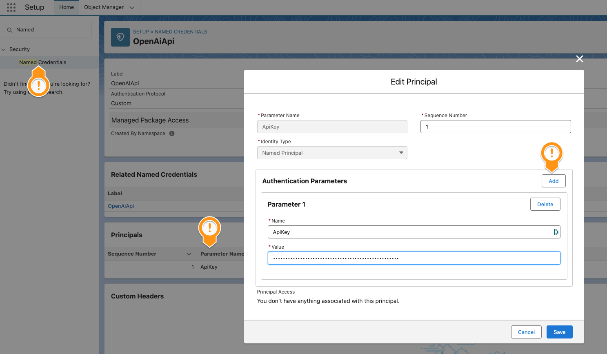

##  My Org Butler

...is a Salesforce app with a Utility Bar chat component that helps org users with their daily work. Using natural language it answers questions about data, metadata and configuration. It can also perform tasks on the user's behalf, like creating or modifying records, making configuration changes or notifying other people.

> ⚠️ **Important:** Before installing DMD, you must first install the [latest version](https://login.salesforce.com/packaging/installPackage.apexp?p0=04tVI000000L3ZBYA0) of the [App Foundations](https://github.com/aquivalabs/app-foundations) package.

- [Install v1.49 as Unlocked Package (Production)](https://login.salesforce.com/packaging/installPackage.apexp?p0=04tVI000000LLkbYAG)

- [Install v1.49 as Unlocked Package (Sandbox)](https://test.salesforce.com/packaging/installPackage.apexp?p0=04tVI000000LLkbYAG)

### Highlight

- Answers questions about data, metadata and org settings
- Creates and updates data and metadata (delete not supported)
- Respects the permissions of the users
- Can explain what it does and self-correct errors
- Leverages [OpenAI Assistant API](https://platform.openai.com/docs/assistants/overview) (Knowledge Retrieval and State Management)
- Implements [autonomous ReAct / AutoGPT agent](https://arxiv.org/pdf/2210.03629.pdf)
- Uses [packageable Named Credentials](/Users/rsoesemann/dev/aquivalabs-open-source/my-org-butler/force-app/main/default/namedCredentials/OpenAiApi.namedCredential-meta.xml) for API Authentication
- Instructions and all tools can be directly used as **[Salesforce Agentforce 2.0]**(https://www.salesforce.com/agentforce/) actions

### Demo Videos

 Agentforce Version

### Documentation

#### How it works

It behaves like a good Butler, in the sense that it does things in the background and only bugs the user when something is unclear. It also would not just do harmful things that are not in the permission of a user and could create potential harm.

This is made possible by Open AI's Assitant API, an Agent technology similar to AutoGPT or [Salesforce upcoming Copilots](https://salesforce.vidyard.com/watch/rZYjTDQ956yQ8sCcE879dV). It uses LLM reasoning to understand a request and makes an action plan based on automations that were made available to the agent. Open AI calls them Functions or Plugins, Salesforce calls them Copilot Actions.

Those automation are not performed by the LLM but just delegated back to Salesforce, which then calls deterministic code.

This PoC shows that in the realm of Salesforce where there is a well-documented REST API for nearly everything a single Action or Function is sufficient. The Org Butler does everything it does just by constructing REST API requests as shown in this PlantUML:

#### Setup in the Org
1. Add your own OpenAI API Key by adding a new Principal Parameter called `ApiKey` in `Setup > Named Credential > External Credential > OpenAiApi.ApiKey` 
1. Populate the Assistant Id fields in the [`MyOrgButler__c Custom Settings`](force-app/main/default/objects/MyOrgButler__c). There are 2 fields to differentiate between Assistants used in Dev and Production orgs.
1. To use the Web Search Tool get a [Free Tavily API Key](https://tavily.com/) and put the Key also into the [`MyOrgButler__c Custom Settings`](force-app/main/default/objects/MyOrgButler__c).

#### OPTIONAL: Use you own OpenAI Assistant
1. Create an OpenAI Assistant using Functions and Instructions like the ones we use. Find them in [`openai-configs`](openai-configs).

#### OPTIONAL: Fully customize

1. Clone the repo
1. Find and replace `aquiva_os` namespace in this repo's files with your own namespace. You can also make it work without a namespace.
1. Create Scratch org
    1. Adjust the DEV_HUB_ALIAS in `/scripts/create-scratch.org.sh`
    1. Run it via `./scripts/create-scratch.org.sh`
1. Adjust the code and metadata    
1. Create a Managed or Unlocked package from it using `/scripts/create-package.sh`

---
> __DISCLAIMER - Simple vs. sophisticated__
>
> This app was not written with a commercial career in mind. So we cut corners in a few places to keep the projects short and focused. So if you see some ugly parts here 
> and there, let us know but be kind to us. This project is mainly about sharing 
> results and excitement in "AI for Salesforce".
>
> We also made some adjustments, and simplifications to the original code to better 
> fit the Open Source purpose. To have less loose metadata parts, we:
>
> - Skipped moving UI text to Custom Labels
> - Merged classes to have the most related code in one place
>